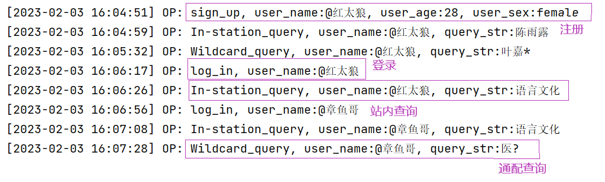

##<center > Web搜索引擎实验报告</center>

 $~~~~~~~~~~~~~~~~~~~~~~~~~~~~~~~~~~~~~~~~~~~~~~$ 计算机科学与技术 $~~~~$ 2012679 王娇妹

###　作业描述

本次作业我们要求实现⼀个系统的Web搜索引擎（主题不限），为用户提供查询服务和个性化推荐。

### 实现思路

#### 网页抓取

##### 1. 网页抓取过程
  
web网页的抓取可以看作一个不断循环的过程，直到爬取结束或者达到了某种设定条件而停止。

开始网页抓取前，初始化几个重要的变量。
 ```python
 # 已经爬取过的网页集合
used_url_set = set()
 # 将要爬取的网页，用列表保存
to_use_url_list = ['http://news.nankai.edu.cn']
 # 字典，记录id对应的url
url_id_dic = dict()
 # 字典，记录url对应的id
id_url_dic = dict()
 # 字典，记录每个url页面可以跳转到的url们 用id标识
url_jump_dic = dict()
 ```

每次爬取，从 to_use_url_list 中选取一个url进行采集，从该url对应的网页中抽取文本和新url，如果新的url未被采集过（不在 used_url_set 中），就将新url加入 to_use_url_list 。
爬取结束后，从 to_use_url_list 中删除已被采集过的url，把它加入 used_url_set 中，然后进入下一次爬取过程。


##### 2. 网页内容处理

* 标题
    对标题去除标点、去除空格、统一为小写后，新建该网页对应的 txt 文件，以`id_标题.txt`命名。
* 文本内容
  去除换行符、制表符之后，保存到标题对应的 txt 文件下。
* url
    每爬取一个url，爬取次数作为该url对应的id，加入字典url_id_dic和id_url_dic中。
    url_jump_dic记录从该正在爬取的url可以跳转到的所有有效url，用于之后的链接分析。

#### 文本索引

##### 锚文本标题

采用向量空间模型，将标题字符串和查询字符串转换为向量并用向量计算来进行处理。

##### 文本内容

文本部分采用倒排索引的方式，以单词为索引，映射到它在哪些txt文档中出现以及出现的次数。

#### 链接分析

在网页抓取阶段，得到了存储每个url与其指向的其他url的字典。链接分析只需遍历所有url，获取其指向的url列表。
借助networkx库即可得到链接分析结果，将pagerank保存到本地。

#### web前端

使用tkinter实现软件前端。

#### 查询服务

##### 1. 登录/注册
创建一个用户信息记录字典 users_info_dic ，保存已注册用户的姓名、年龄、性别，键为用户名。
* 登录
  输入用户名，查询该用户名是否在 users_info_dic ，如果存在则登录成功。否则提示用户名不存在并询问是否需要注册。
  
* 注册
  输入用户名、年龄、性别，将其保存到 users_info_dic 。

##### 2. 日志记录

日志中记录时间、动作（登录、注册、站内查询、通配查询）、用户名。
如果是注册，还需记录注册人的年龄、性别，如果是查询，还需记录查询语句。

##### 3. 站内查询

将输入的查询语句去除空格、标点、停用词，统一为小写。
借助jieba进行分词，得到查询单词列表。
分别进行标题、内容的查询，最后将标题查询结果、内容查询结果、链接结果赋以不同权重，相加。
最后输出相似度最高的五个网页的标题和url。

##### 4. 通配查询

?匹配单个字符，*匹配任意字符序列。
使用 fnmatch() 函数对文档单词集合和输入查询语句进行通配符号的匹配，得到包含在文档单词集合中的查询单词列表。
然后类似站内查询，输出相似度最高的五个网页的标题和url。

#### 个性化查询

根据用户年龄，对标题与内容查询的权重进行调整。
年龄大于25岁，内容查询结果所占比例更大；年龄小于25岁，标题查询结果所占比例更大。

#### 个性化推荐

个性化推荐也基于用户年龄。
对于年龄小于25岁的用户，随机推荐关于开学典礼、优秀学生、南开杰出人物方面的内容；年龄大于25岁的用户，随机推荐关于南开发展前景、学科成果方面的内容。

### 效果截图

#### 登录/注册
##### 1. 登录/注册界面


##### 2. 选择登录，用户已注册
输入用户名，点击“log in”按钮，如果用户已注册，弹出登录成功对话框。

点击确定，即可进行查询，查询界面如下，有站内查询、通配查询两种方式可以选择。


##### 3. 选择登录，用户名未注册

弹出提示信息，点击“是”，进入用户注册窗口。


##### 4. 用户注册
输入用户名、年龄、性别，点击“save info”按钮，弹出注册成功对话框，并询问是否开始查询。

点击“是”，会进入查询页面。


#### 日志


#### 

